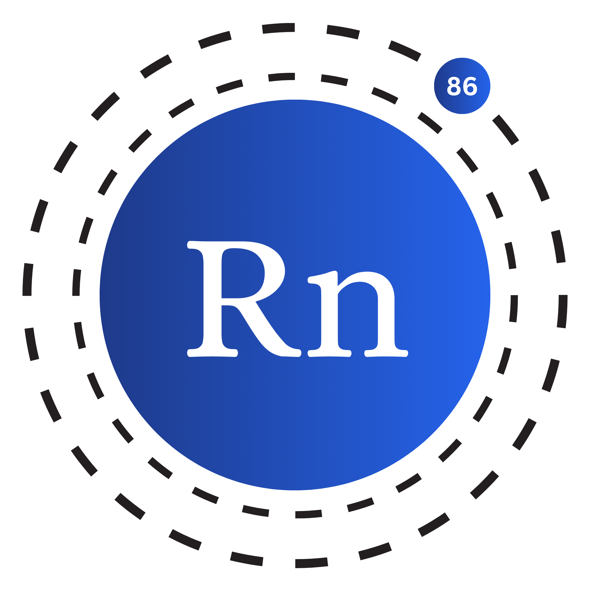

<div align="center">


<h1>The Radon Programming Language</h1>
<p>A general-purpose programming language, focused on simplicity, safety and stability.</p>

[Website](https://radon-project.github.io)
•
[Documentation](https://radon-project.github.io/docs)
•
[Tests](tests/)
•
[Examples](examples/)


[](https://github.com/radon-project/radon)
[](https://discord.gg/C2aVE9ya6N)

</div>

Radon is a dynamically-typed, general-purpose programming language designed to
be easy to learn and use, with a syntax that will feel familiar if you already
know Python, JavaScript, or C-family languages. It's under active development,
with a growing feature set that already includes:

- **Object-oriented programming** — classes, single/multiple/multilevel/hybrid
  inheritance with `super()`, enforced `public`/`private`/`protected` access
  modifiers, abstract classes, and operator overloading via magic methods
- **`async`/`await`** with real concurrency through `spawn()`/`sleep()`/`gather()`
- Closures, error handling (`try`/`catch`/`raise`), modules and
  `from ... import ...`, and a growing Radon standard library
- A Python interop bridge (`pyapi()`) for calling into and from Python code
- A REPL with live syntax highlighting, and a CI-gated test suite covering
  the language itself

See the [documentation](https://radon-project.github.io/docs) for the full
language guide.

## Installation

```bash
git clone https://github.com/radon-project/radon.git
cd radon

# To run the repl
python radon.py

# To run a .rn file
python radon.py <filename>
```

Read the [documentation](https://radon-project.github.io/docs) to learn more about the language.

## Quick Start

Here is a simple example of a Radon program that asks the user for their username and password and then checks if the username is "radon" and the password is "password". If the username and password are correct, it prints "Log in successful", otherwise it prints "Invalid credentials".

```radon
import io

class Network {
    fun __constructor__(username, password) {
        this.username = username
        this.password = password
    }

    fun login() {
        if this.username == "radon" {
            if this.password == "password" {
                print("Log in successful")
            } else {
                print("Invalid credentials")
            }
        } else {
            print("Invalid credentials")
        }
    }
}

var username = input("Enter your username: ")
# Access password securely using get_password
var password = io.Input.get_password("Enter your password: ")

var network = Network(username, password)
network.login()
```

Radon also supports inheritance, enforced access modifiers, and `async`/`await`
with real concurrency:

```radon
abstract class Shape {
    fun area() # abstract -- every concrete subclass must implement this

    public fun label() -> "a shape"
}

class Circle(Shape) {
    fun __constructor__(radius) {
        this.radius = radius
    }

    fun area() -> this.radius * this.radius * 3.14159
}

async fun describe(shape) {
    await sleep(0.1) # e.g. standing in for a slow I/O call
    return shape.label() + " with area " + str(shape.area())
}

print(await describe(Circle(2))) # a shape with area 12.56636
```

See the [async and concurrency guide](https://radon-project.github.io/docs/async.html)
and [classes guide](https://radon-project.github.io/docs/classes.html) for more.

## Contributing

We need contributors to help us build the language. If you are interested, please make contributions to the `radon-project/radon` repository.

Steps to contribute:

1. Fork the repository
2. Clone the repository
3. Create a new branch
4. Make changes
5. Commit changes
6. Push to the branch
7. Create a pull request

Before making a pull request create an issue and discuss the changes you want to make. If you have any questions, feel free to ask in the issues section.

Every pull request is checked by CI, so before pushing, run the same checks locally:

```bash
python -m pip install -r requirements-dev.txt

python test.py full   # runs the test suite, mypy --strict, and ruff
# or, equivalently:
make test
```

Individual pieces, if you'd rather run them separately:

```bash
make lint       # ruff format --check . && ruff check .
make typecheck  # mypy . --strict
python test.py run tests/lang/<file>.rn   # a single test file
```

You can also join our [Discord server](https://discord.gg/C2aVE9ya6N) to discuss the language and get help.

## License

We are using GNU General Public License v3.0. You can check the license [here](LICENSE).
